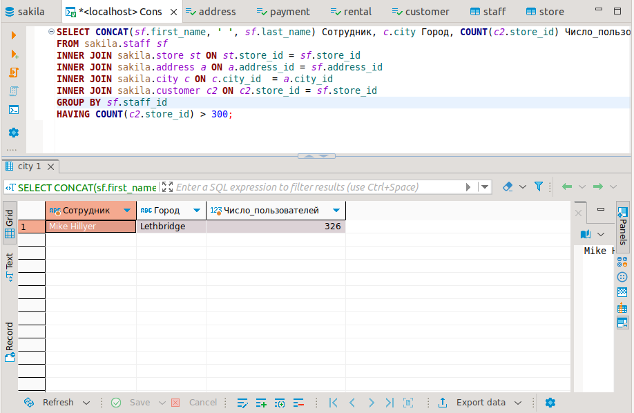
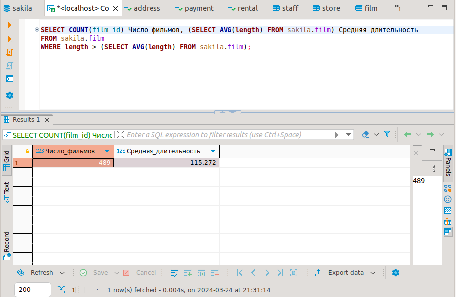
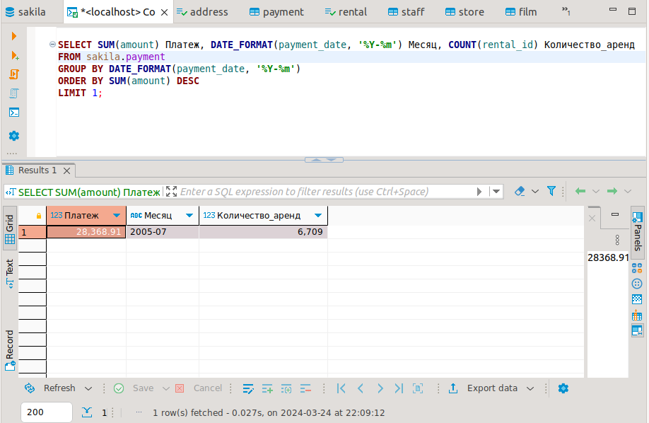

## Домашнее задание к занятию "SQL. Часть 2" - Карих Елена
---
### Задание 1

Одним запросом получите информацию о магазине, в котором обслуживается более 300 покупателей, и выведите в результат следующую информацию:
- фамилия и имя сотрудника из этого магазина;
- город нахождения магазина;
- количество пользователей, закреплённых в этом магазине.

### Решение 1

Запрос:

```
SELECT CONCAT(sf.first_name, ' ', sf.last_name) Сотрудник, c.city Город, COUNT(c2.store_id) Число_пользователей
FROM sakila.staff sf
INNER JOIN sakila.store st ON st.store_id = sf.store_id
INNER JOIN sakila.address a ON a.address_id = sf.address_id
INNER JOIN sakila.city c ON c.city_id  = a.city_id
INNER JOIN sakila.customer c2 ON c2.store_id = sf.store_id
GROUP BY sf.staff_id
HAVING COUNT(c2.store_id) > 300;
```



---
### Задание 2

Получите количество фильмов, продолжительность которых больше средней продолжительности всех фильмов.

### Решение 2

Запрос:

```
SELECT COUNT(film_id) Число_фильмов, (SELECT AVG(length) FROM sakila.film) Средняя_длительность
FROM sakila.film 
WHERE length > (SELECT AVG(length) FROM sakila.film);
```



---
### Задание 3

Получите информацию, за какой месяц была получена наибольшая сумма платежей, и добавьте информацию по количеству аренд за этот месяц.

### Решение 3

Запрос:

```
SELECT SUM(amount) Платеж, DATE_FORMAT(payment_date, '%Y-%m') Месяц, COUNT(rental_id) Количество_аренд 
FROM sakila.payment
GROUP BY DATE_FORMAT(payment_date, '%Y-%m')
ORDER BY SUM(amount) DESC 
LIMIT 1;
```



---
